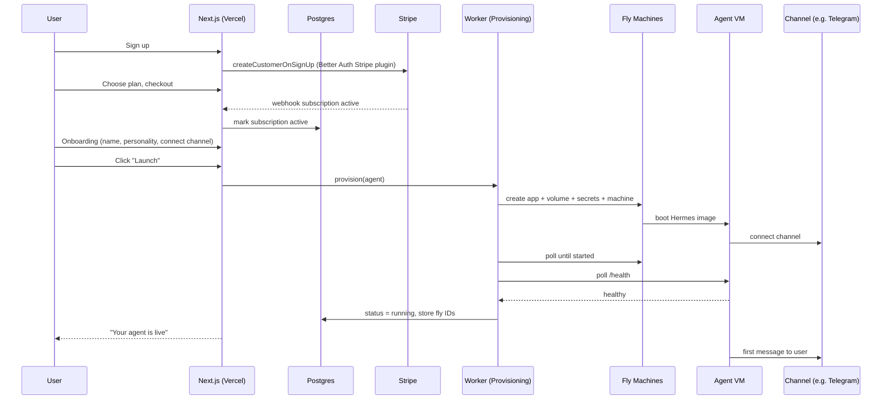

# AgntOS - Implementation Plan

One-click hosting for **Hermes Agent** (the self-hosted autonomous agent by Nous Research), aimed at non-technical users.

---

## 0. Stack (locked)

| Layer | Choice | Role |
|---|---|---|
| Frontend + API (control plane) | **Next.js (App Router) on Vercel** | Marketing, dashboard, signup, API routes, webhooks |
| Auth | **Better Auth** | Email/password + OAuth, sessions, customer creation |
| Payments | **Stripe** (via `@better-auth/stripe` plugin) | Subscriptions + one-time credit packs |
| Database (control plane) | **Railway Postgres** | Users, billing, agent registry, wallet, usage |
| Email | **Resend** | Transactional email (verify, receipts, low-balance, agent status) |
| ORM | **Drizzle** | Schema + migrations against Railway Postgres |
| Agent data plane | **Fly Machines** (Firecracker microVM per agent) | The actual running agents; migrate to Hetzner at scale |
| Token routing/metering | **OpenRouter** (per-user capped key) | Model policy baked into Hermes config; OpenRouter enforces spend cap |
| Job queue | **pg-boss** on Railway Postgres | Provisioning + lifecycle jobs (retries, idempotency). No new vendor |
| Background worker | **Railway service** | Runs the pg-boss consumer, provisioning polls, and usage-sync cron |
| Container registry | **GHCR** (GitHub) | Hosts the pre-baked Hermes agent image |
| DNS / registrar | **Cloudflare** | Domain, DNS, registrar-at-cost |
| Error monitoring | **Sentry** | Control plane, worker, and agent errors |
| Product analytics | **PostHog** | Onboarding funnel + activation tracking |
| Tax | **Stripe Tax** | GST (AU) + VAT + US sales tax on global sales |
| Object storage | **Cloudflare R2** *(add when needed)* | Memory backups/snapshots, user uploads, agent artifacts. Zero egress fees |

**Core principle:** keep the **control plane** (everything above the data plane line) completely separate from the **data plane** (the agent VMs). The control plane never changes when you swap or scale the data plane.

---

## 1. Architecture

```
                      ┌──────────────────────── CONTROL PLANE ────────────────────────┐
   Browser ──────────▶│  Next.js on Vercel                                             │
                      │   ├─ Marketing + Pricing                                       │
                      │   ├─ Auth (Better Auth)                                        │
                      │   ├─ Dashboard (agent status, wallet, billing)                 │
                      │   └─ API routes:                                               │
                      │        /api/auth/*        (Better Auth)                        │
                      │        /api/stripe/webhook (subscriptions + credit packs)      │
                      │        /api/agents/*      (launch / pause / delete)            │
                      │                                                                │
                      │  Railway Postgres  ◀── users, subs, agents, wallet, usage      │
                      │  Resend            ◀── transactional email                     │
                      └───────────────┬────────────────────────────────────────────────┘
                                      │  (provisioning + usage sync)
                      ┌───────────────▼──────────── DATA PLANE ────────────────────────┐
                      │  Provisioning Service ──▶ Fly Machines API                     │
                      │       creates/starts/stops/destroys one microVM per agent      │
                      │                                                                │
                      │  Per user:  [ Fly microVM ] ── Hermes daemon + volume (memory + skills) │
                      │                   │                                            │
                      │                   └──▶ OpenRouter (per-user capped key) ──▶ models │
                      └────────────────────────────────────────────────────────────────┘
```

The **Provisioning Service** sits behind an interface so the underlying provider (Fly today, Hetzner later) is swappable. Hermes calls OpenRouter directly with a per-user key whose credit limit is the spend cap, so there is no token proxy to run.

---

## 2. Repository layout

Monorepo (pnpm workspaces) or single Next.js app to start. Recommended single app + one small worker service:

```
/app                      Next.js (Vercel)
  /app/(marketing)        landing + pricing
  /app/(dash)             authenticated dashboard
  /app/api/auth/[...all]  Better Auth handler
  /app/api/stripe/webhook Stripe webhook
  /app/api/agents         launch/pause/delete endpoints
/lib
  auth.ts                 Better Auth config
  db.ts                   Drizzle client
  stripe.ts               Stripe client
  email.ts                Resend wrapper
  provisioning/           provider interface + FlyProvider
  billing/                wallet + credit logic
/db/schema.ts             Drizzle schema
/worker                   provisioning + lifecycle + usage-sync; pg-boss consumer (Railway service)
/agent-image              Hermes Dockerfile + baked config.yaml + entrypoint
```

The **worker** runs as a small always-on service (not a Vercel function) because provisioning polling and usage sync need a persistent process. **Deploy it on Railway**, alongside the Postgres that backs the queue, so the worker and pg-boss share one network and one database. No token proxy is needed.

---

## 3. Data model (Drizzle / Postgres)

Better Auth creates `user`, `session`, `account`, `verification`. The Stripe plugin adds `subscription` and a `stripeCustomerId` on the user. App-owned tables below.

```ts
// agents - one row per provisioned agent
agent {
  id            uuid pk
  userId        text -> user.id
  name          text
  personality   text
  model         text            // default route, e.g. "auto"
  tier          text            // 'starter' | 'pro'
  status        text            // 'provisioning'|'running'|'paused'|'stopped'|'error'
  flyAppId      text
  flyMachineId  text
  flyVolumeId   text
  region        text
  ramMb         integer
  createdAt     timestamptz
  updatedAt     timestamptz
}

// channels - messaging surfaces connected to an agent
channel {
  id          uuid pk
  agentId     uuid -> agent.id
  type        text   // 'telegram'|'whatsapp'|'slack'|...
  status      text   // 'connected'|'pending'|'error'
  externalRef text   // non-secret ref only; tokens live in Fly secrets
  createdAt   timestamptz
}

// wallet - prepaid credit balance (managed users)
wallet {
  userId     text pk -> user.id
  balanceMc  bigint   // micro-dollars (avoids float errors)
  budgetMc   bigint   // optional monthly cap (BYOK users set this)
  updatedAt  timestamptz
}

// credit_txn - every balance movement
credit_txn {
  id              uuid pk
  userId          text
  type            text   // 'topup'|'usage'|'grant'|'refund'
  amountMc        bigint // +topup / -usage
  balanceAfterMc  bigint
  stripePaymentId text   // for top-ups
  meta            jsonb
  createdAt       timestamptz
}

// usage_event - per model call, synced from OpenRouter usage API
usage_event {
  id           uuid pk
  agentId      uuid
  userId       text
  model        text
  inputTokens  integer
  outputTokens integer
  costMc       bigint
  occurredAt   timestamptz
}

// byok_key - encrypted at rest, never logged (or store only in Fly secrets)
byok_key {
  id           uuid pk
  userId       text
  provider     text
  cipherText   text   // libsodium/KMS-encrypted
  createdAt    timestamptz
}

// audit_log
audit_log { id, userId, action, meta jsonb, createdAt }
```

Money is stored as **micro-dollars (bigint)** everywhere to avoid floating-point drift.

---

## 4. Authentication - Better Auth

`lib/auth.ts`:

```ts
import { betterAuth } from "better-auth";
import { drizzleAdapter } from "better-auth/adapters/drizzle";
import { nextCookies } from "better-auth/next-js";
import { stripe } from "@better-auth/stripe";
import Stripe from "stripe";
import { db } from "./db";

const stripeClient = new Stripe(process.env.STRIPE_SECRET_KEY!, {
  apiVersion: "2026-03-25.dahlia",
});

export const auth = betterAuth({
  database: drizzleAdapter(db, { provider: "pg" }),
  emailAndPassword: { enabled: true, requireEmailVerification: true },
  socialProviders: {
    google: { clientId: process.env.GOOGLE_ID!, clientSecret: process.env.GOOGLE_SECRET! },
  },
  emailVerification: {
    sendVerificationEmail: async ({ user, url }) => sendEmail.verify(user.email, url),
  },
  plugins: [
    stripe({
      stripeClient,
      stripeWebhookSecret: process.env.STRIPE_WEBHOOK_SECRET!,
      createCustomerOnSignUp: true,
      // map your Stripe price IDs to Starter / Pro here
    }),
    nextCookies(), // MUST be last in the array
  ],
});
```

Route handler: `app/api/auth/[...all]/route.ts` exports the Better Auth handler. Protect dashboard routes by checking the session server-side. Run `npx @better-auth/cli generate` to emit the auth + Stripe tables into the Drizzle schema, then migrate.

**Gotcha:** without `nextCookies()` as the last plugin, cookies set inside Server Actions silently fail.

---

## 5. Payments & billing - Stripe

Two distinct money flows:

**a) Subscriptions (the plan).** Handled largely by the Stripe plugin. Create two Stripe products with monthly recurring prices: **Starter $29**, **Pro $49**. The plugin creates the Stripe customer on signup, runs Checkout, exposes the customer portal, and keeps the `subscription` table in sync via webhooks (it verifies signatures internally).

**b) Credit packs (the wallet).** These are **one-time** payments, not subscriptions, so handle them with your own Checkout session + webhook logic alongside the plugin:

1. User clicks "Add $25" → create a one-time Checkout Session (`mode: "payment"`) with metadata `{ userId, kind: "credit_topup", amountMc }`.
2. On `checkout.session.completed` (in `/api/stripe/webhook`), if `kind === "credit_topup"`, credit the wallet inside a DB transaction and write a `credit_txn` row.
3. Email a receipt via Resend.

**Add-ons** (extra agent, 8GB, dedicated IP, backups, priority support) are Stripe subscription items added to the user's subscription. White-glove onboarding is a one-time payment.

**Webhook events to handle:**
`checkout.session.completed`, `customer.subscription.updated`, `customer.subscription.deleted`, `invoice.payment_failed`. The first drives credit top-ups; the rest drive agent lifecycle (suspend on `deleted`/repeated `payment_failed`).

**Tax (Stripe Tax).** You are selling globally from Australia, so enable Stripe Tax before real revenue arrives. It auto-calculates GST (register once you cross the AUD $75k threshold), plus VAT and US sales tax, and applies it at Checkout. Turn it on for both subscriptions and credit-pack Checkout sessions.

---

## 6. Model policy & credit wallet

**Two separate concerns, kept simple:** (a) *which model runs which task* is decided by you and baked in, and (b) *how spend is capped and metered* is handled by per-user OpenRouter keys. You do not build a routing proxy.

### a) Model policy (operator-controlled, baked into the image)

Hermes has a built-in dual-model architecture: one main model for core reasoning and the tool-call loop, plus eight auxiliary slots for side tasks (compression, vision, session titles, web summarization, etc.), each pointable at a different model. It also integrates OpenRouter's Pareto Code Router (set a quality threshold, it picks the cheapest model that clears it). All of this lives in `~/.hermes/config.yaml`.

So AgntOS ships a curated `config.yaml` inside the agent image:
- **Main model:** the reasoning model for the tier (Standard vs Smart).
- **Auxiliary slots:** cheap models (e.g. DeepSeek V4, Gemini Flash) for all the side tasks. This is the biggest cost lever, because Hermes sends 6-20K tokens of tool definitions on every call plus extra calls for its learning loop and compression.
- **Optional:** Pareto router for coding tasks with a fixed `min_coding_score`.

The user **never sees a model name**. At most, a single **Standard vs Smart** toggle swaps the main model, mapped to the Starter/Pro tier (or a paid add-on). Identical config across users means predictable cost and trivial support.

### b) Spend cap & metering (per-user OpenRouter key)

Skip the proxy. At provisioning, mint a **per-user OpenRouter key with a hard credit limit equal to their wallet balance**:
1. Hermes talks to OpenRouter directly using that key + the baked config.
2. OpenRouter enforces the cap, so the agent stops when credits are exhausted. That is your **hard stop**, no custom code.
3. A worker job polls OpenRouter's usage/activity API, writes `usage_event` rows, and updates the displayed wallet balance. Top-ups raise the key's credit limit.

Tradeoff vs a self-built proxy: the balance display is near-real-time (poll cadence) rather than instant. Acceptable for this product, and it removes an entire always-on service. (If you later want instant control or want to add your own margin per call, you can reintroduce a thin metering proxy behind the same interface.)

**BYOK path:** inject the user's own provider key into the agent's config; you don't meter (it's their bill). Offer an optional spend cap by minting them a capped OpenRouter key instead of using a raw provider key.

**Low-balance email** at ~20% remaining, plus optional **auto-top-up** (raise the OpenRouter limit when balance hits a threshold). Show a **dollar wallet** with balance + burn rate, never raw tokens.

---

## 7. Transactional email - Resend

`lib/email.ts` wraps the Resend SDK. Use React Email for templates. Triggers:

- Verify email (Better Auth `sendVerificationEmail`)
- Password reset
- Welcome / agent-ready ("Your agent is live, message it on Telegram")
- Payment receipt (subscription + each credit pack)
- Low balance (20%) and balance depleted (agent paused)
- Payment failed / agent suspended
- Subscription cancelled / agent scheduled for deletion

Verify your sending domain (SPF/DKIM) in Resend before launch.

---

## 8. Provisioning service - Fly Machines

A provider interface so the data plane is swappable:

```ts
interface AgentProvider {
  create(input: CreateAgentInput): Promise<{ appId; machineId; volumeId; region }>;
  start(ref): Promise<void>;
  stop(ref): Promise<void>;       // pause: drops to storage-only billing
  destroy(ref): Promise<void>;    // delete machine + volume + app
  resize(ref, ramMb): Promise<void>; // tier upgrade
  health(ref): Promise<"ok" | "starting" | "error">;
}
```

`FlyProvider` uses the Fly Machines REST API (`https://api.machines.dev`) with `FLY_API_TOKEN`:

1. **Create a Fly app per user** (clean secret scoping + one-call teardown).
2. **Create a volume** for the agent's Markdown memory.
3. **Set secrets** on the app: per-user OpenRouter key, channel tokens, `USER_ID`, `AGENT_ID`. Secrets are encrypted by Fly and injected as env at boot.
4. **Create a machine** from the pre-baked Hermes image, sized per tier (`ramMb` = 2048 Starter / 4096 Pro), with the volume mounted.
5. **Poll** machine state until `started`, then poll the agent's `/health` endpoint.
6. **Persist** `flyAppId / flyMachineId / flyVolumeId / status` on the `agent` row.

All of this runs in the **worker** service (persistent process), not a Vercel function, because polling can take 30–90s.

**Job queue (pg-boss on Railway).** Wrap provisioning and lifecycle work in pg-boss jobs backed by the Railway Postgres you already run, with the pg-boss consumer living in the Railway worker service. This gives you retries, idempotency, and backoff for free, so a failed launch (Fly API hiccup, slow boot) recovers cleanly instead of leaving a half-created agent. Jobs: `provision_agent`, `pause_agent`, `destroy_agent`, `reconcile_lifecycle` (cron). Make each idempotent and keyed on `agentId`. Keeping the queue in Postgres means no extra broker (no Redis, no SQS) to operate.

---

## 9. Agent image - hardened Hermes Agent

A versioned image built in CI and pushed to GHCR:

- Base on the Hermes Agent runtime (`github.com/NousResearch/hermes-agent`) + a headless Chromium for browser automation. Hermes installs via a single command, which keeps the Dockerfile simple.
- **Entrypoint script** reads env/secrets and configures the agent: name, personality, the per-user OpenRouter key, and connects the chosen channel. The model policy itself ships as a baked **`~/.hermes/config.yaml`** (main model + the eight auxiliary slots set to cheap models), so model choice is operator-controlled, not exposed to the user. A Standard/Smart tier just swaps the main-model line.
- Run as **non-root**; drop capabilities; restrict outbound network where feasible.
- Mount the volume at Hermes' data path so both **persistent memory and self-written skills** survive restarts. Hermes accumulates memory across sessions and writes its own reusable skills, so the volume holds more than just chat history.
- Pin a version tag per release so launches are reproducible; gate upgrades behind a controlled rollout.

**Security note specific to Hermes:** it writes and runs its own skills (self-modifying code). That makes per-agent microVM isolation non-negotiable, since the agent literally generates new code to execute. It also complicates strict audit trails, so log skill creation events to the audit log if you later need compliance-grade traceability.

---

## 10. End-to-end provisioning flow



---

## 11. Agent lifecycle

| Action | Effect |
|---|---|
| **Pause** | `stop` machine → billing drops to volume/rootfs storage only |
| **Resume** | `start` machine |
| **Upgrade tier** | `resize` to larger RAM (or recreate on bigger machine) |
| **Delete** | `destroy` machine + volume + app |
| **Wallet depleted** (managed) | OpenRouter credit cap hits zero; agent flagged; low/zero-balance emails |
| **Payment failed / cancelled** | grace period → auto-pause → after retention window → destroy |

A **lifecycle cron** (in the worker) runs hourly: reconcile DB status vs Fly reality, suspend agents whose subscription is `past_due`/`canceled` past grace, and clean up orphaned resources.

---

## 12. Security model

- **Isolation:** one Firecracker microVM per agent (Fly). Never run multiple users' code-executing agents in shared-kernel containers.
- **Secrets:** channel tokens and model keys live in Fly secrets per app, never in the DB as plaintext. BYOK keys, if stored, are encrypted at rest (libsodium or a KMS) and never logged.
- **Network:** each app/machine is isolated; no cross-tenant private networking.
- **Webhooks:** verify Stripe signatures (plugin does subscriptions; verify your own credit-pack handler too).
- **Rate limits + auth** on `/api/agents/*`; per-user OpenRouter keys are scoped and revocable.
- **Hard spend stop** via the per-user OpenRouter credit cap is both a cost control and an abuse control.
- **Audit log** every provisioning and billing action.

### Observability & backups

- **Sentry** across the Next.js app, the worker, and agent-side errors. Tag events with `userId`/`agentId` so a failed launch is traceable end to end.
- **PostHog** for the onboarding funnel: track `signup`, `plan_selected`, `channel_connected`, `agent_launched`, `agent_first_message`, `credits_topped_up`. This is where you will see exactly which step loses non-techies.
- **Logs:** ship worker logs to your log tool (Better Stack or Axiom). Fly streams agent logs separately.
- **Backups (Cloudflare R2, when enabled):** the memory-backup add-on snapshots each agent's volume to R2 on a schedule. R2 is the right home because it has zero egress fees and you already run Cloudflare. Also use R2 for any user file uploads and agent-produced artifacts.

---

## 13. Dashboard surfaces

- **Agent card:** status, channel(s), "open chat" deep link, pause/resume/delete.
- **Wallet:** balance, burn rate, recent activity ("ran morning briefing, ~$0.30"), add-credits, auto-top-up toggle.
- **Token source toggle:** BYOK (paste key) vs Managed (buy credits). Plus a Standard/Smart model toggle (swaps the main model only).
- **Billing:** plan, add-ons, Stripe customer portal link, invoices.
- **Onboarding wizard:** name → personality → connect channel → launch.

---

## 14. Environment variables

```
# Core
DATABASE_URL=                 # Railway Postgres
BETTER_AUTH_SECRET=
BETTER_AUTH_URL=
# OAuth
GOOGLE_ID= / GOOGLE_SECRET=
# Stripe
STRIPE_SECRET_KEY=
STRIPE_WEBHOOK_SECRET=
STRIPE_PRICE_STARTER= / STRIPE_PRICE_PRO=
# Email
RESEND_API_KEY=
# Data plane
FLY_API_TOKEN=
FLY_ORG=
AGENT_IMAGE_REF=
# Tokens
OPENROUTER_API_KEY=
OPENROUTER_PROVISIONING_KEY=    # mints per-user capped keys
# Crypto
ENCRYPTION_KEY=               # for BYOK keys at rest
# Observability
SENTRY_DSN=
NEXT_PUBLIC_POSTHOG_KEY= / NEXT_PUBLIC_POSTHOG_HOST=
# Object storage (add when backups/uploads ship)
R2_ACCOUNT_ID= / R2_ACCESS_KEY_ID= / R2_SECRET_ACCESS_KEY= / R2_BUCKET=
```

Notes: Stripe Tax is enabled in the Stripe dashboard, not via env. GHCR auth and the agent-image build live in CI (GitHub Actions), pushing to `AGENT_IMAGE_REF`. pg-boss reuses `DATABASE_URL`.

---

## 15. Build phases

**Phase 0 - Foundations (week 1–2)**
Next.js on Vercel, Railway Postgres, Drizzle schema, Better Auth (email + Google), email verification via Resend, protected dashboard shell. Domain + DNS on Cloudflare. Sentry and PostHog wired from day one.

**Phase 1 - Billing (week 2–3)**
Stripe plugin, Starter/Pro products, Checkout, customer portal, webhook route, **Stripe Tax enabled**. Credit packs (one-time Checkout + wallet credit). Wallet UI.

**Phase 2 - Provisioning MVP (week 3–5)**
`AgentProvider` interface + `FlyProvider`. Agent image built in CI and pushed to **GHCR**. **pg-boss** job queue for provisioning/lifecycle. Launch flow with **one channel (Telegram)** first. Health checks, status in dashboard, pause/delete.

**Phase 3 - Token layer (week 5–6)**
Per-user capped OpenRouter keys (OpenRouter enforces the spend cap), baked model-policy config.yaml, usage-sync cron, wallet UI. BYOK path. Low-balance + auto-top-up.

**Phase 4 - Lifecycle + add-ons (week 6–7)**
Suspend-on-non-payment cron, tier upgrade/resize, add-ons as subscription items, full Resend transactional set.

**Phase 5 - Hardening + private beta (week 7–9)**
Sentry, uptime/log monitoring, abuse + rate limits, security pass on secrets/isolation, onboarding polish. Invite a small beta cohort.

**Phase 6 - Scale**
Add WhatsApp/Slack channels and more models. Build `HetznerProvider` and migrate the data plane (control plane untouched).

---

## 16. Migration path (Fly → Hetzner)

Because every agent runtime sits behind `AgentProvider`, scaling is implementing a second provider, not a rewrite:
- **Now → ~100 agents:** `FlyProvider`, one microVM per user.
- **~100 → few hundred:** still Fly, or Hetzner Cloud VM-per-user (`HetznerCloudProvider`) for ~50% lower infra cost.
- **Hundreds+:** `HetznerDedicatedProvider` running your own Firecracker fleet on big boxes, once you have infra muscle. Margin jumps from ~48% to ~70% per the cost model.

---

## 17. Open decisions & risks

- **Channel onboarding for non-techies:** WhatsApp/Telegram pairing is the trickiest UX step. Start with Telegram (simplest bot token flow), add WhatsApp later (heavier verification).
- **Default token policy:** confirm BYOK-vs-managed default and the included-credit allowance per tier before building the wallet UI.
- **Image update strategy:** how to roll Hermes version upgrades to live agents without breaking running sessions.
- **Fly app-per-user limits:** confirm account-level app/machine limits with Fly before scaling past a few hundred.
- **Abuse:** agents run arbitrary shell + browser; define an acceptable-use policy and outbound restrictions early.
- **Data residency:** Sydney users may want AU-region machines; Fly has Sydney, Hetzner does not (closest is Singapore).
- **Brand / domain:** decided - **AgntOS**, domain **agntos.io**. Secure the domain and verify the trademark.

---

### Reference docs
- Better Auth: better-auth.com/docs (Next.js integration, Drizzle adapter, Stripe plugin)
- Stripe: docs.stripe.com (Checkout, webhooks, customer portal)
- Fly Machines API: fly.io/docs/machines
- Resend: resend.com/docs
- Hermes Agent: github.com/NousResearch/hermes-agent · hermes-agent.org · hermes-agent.nousresearch.com
- pg-boss: github.com/timgit/pg-boss
- Cloudflare R2: developers.cloudflare.com/r2
- Sentry: docs.sentry.io · PostHog: posthog.com/docs · Stripe Tax: docs.stripe.com/tax
